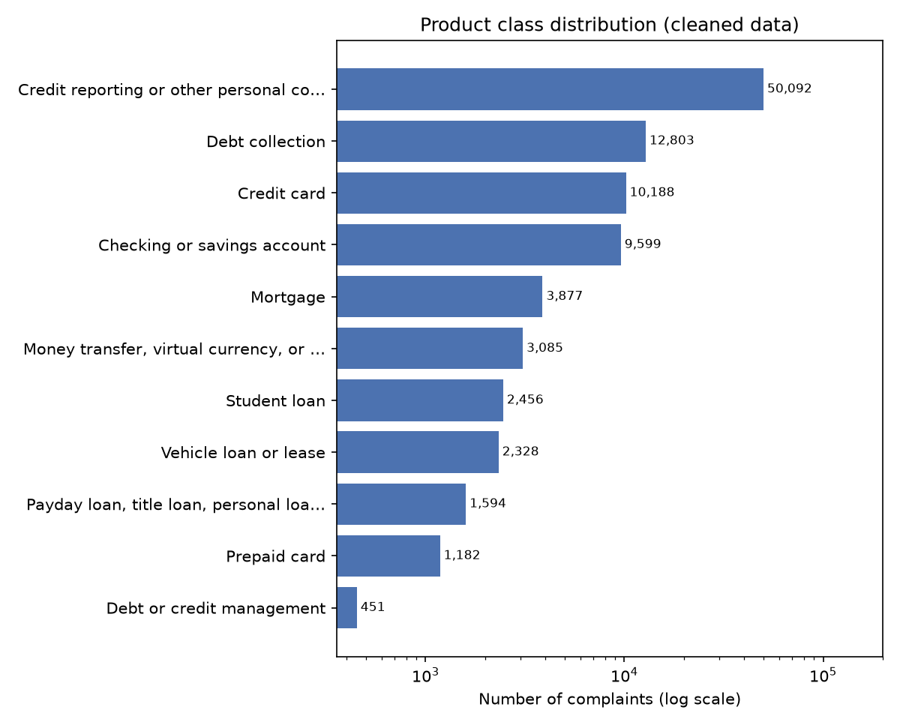
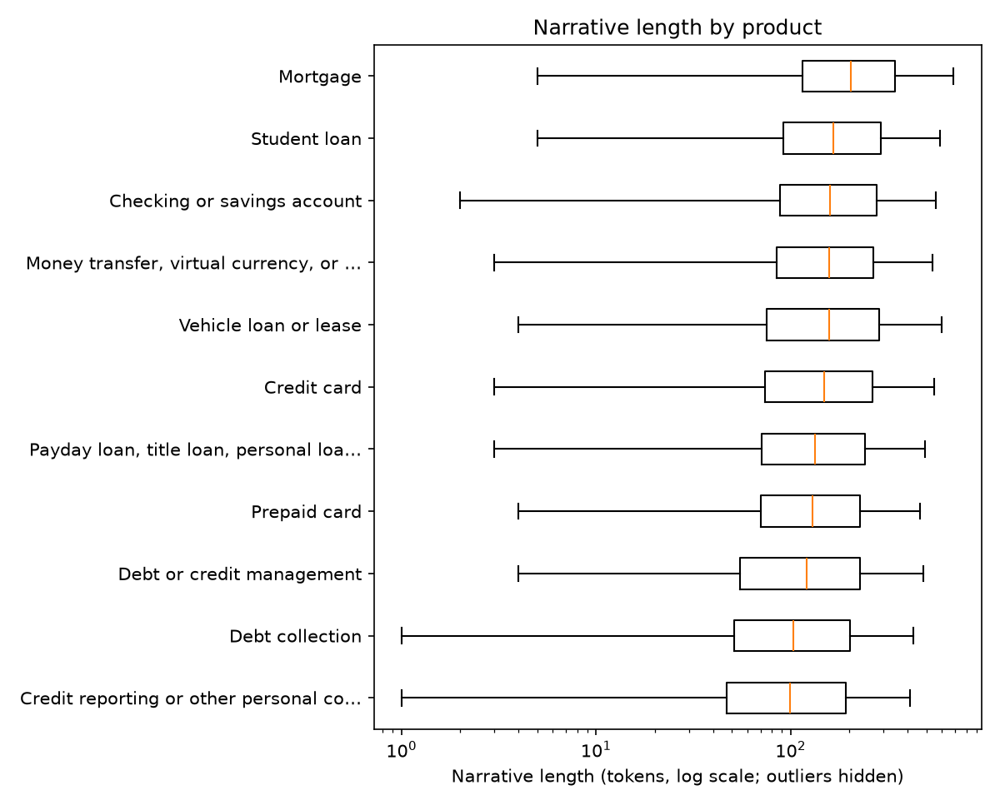

# Milestone 2 Approval Memo: Team 32 (KASS Tech), CSCI 3052
**Project:** Product triage of CFPB consumer complaint narratives
**Prepared by:** Kevin Thomas (Coordinator / Data Lead), with Alex, Subangan, Sayon
**Date:** 2026-10-02

## 1. Data source and license
CFPB Consumer Complaint Database, narratives archive file covering April–July 2024 (`data/raw/complaints.csv`, downloaded 2026-09-30). Public federal data; terms checked on 2026-10-02 by Kevin Thomas: CFPB states that the data is "freely available for anyone to use, analyze, and build on", and no formal license text or attribution requirement was found. Because CFPB stopped publishing narratives on Aug 14, 2026, this archive is a fixed, frozen snapshot. Details: `docs/DATA_CARD.md`.

## 2. Data card summary
- Raw rows: 839,903; rows with a narrative: 276,332; after cleaning: 276,275; after keeping one row per duplicate group, the final modelling set is 97,655 distinct complaints in 11 classes.
- Label: `Product` (normalised). Input: `Consumer complaint narrative` (masked tokens removed).
- Dropped classes (< 200 rows): none.

## 3. Sample inputs and outputs
| complaint_id | narrative (first 150 chars, normalised) | product (label) | Stratified Random prediction |
|---|---|---|---|
| 8781165 | i wrote to mohela on regarding a payment i had made that was debited from my checking account and never reflected on my loan balance. i have still not | Student loan | Debt collection |
| 8766695 | my direct deposit from social security administration and was connected to this account and the account was closed illegally without my permission. 18 | Checking or savings account | Credit reporting or other personal consumer reports |
| 9474196 | i was denied a car loan on with navy federal, even though financially i can afford a car. i was deemed risky due to inaccuracies on my credit report | Vehicle loan or lease | Debt collection |

Rows come from the validation split (the test split is untouched); masked tokens such as `XX/XX/XXXX` have been removed, which is why some sentences have gaps. The baseline ignores the text, so its predictions are just random draws from the training class mix. Full sample: `results/tables/sample_io.csv`.

Model output (from M3 on): one predicted `Product` per narrative, plus per-class scores for NB/LR.

## 4. Initial EDA findings
- Class distribution: majority class Credit reporting or other personal consumer reports = 51.3% of rows; minority class Debt or credit management = 0.46%; imbalance ratio 111:1; normalised entropy 0.68. A stratified-random guesser would get accuracy ≈ 0.31 but Macro F1 only ≈ 0.091 (= 1/11). (Figure 1)
- Narrative length: median 119 tokens; 5,308 narratives (5.4%) are under 20 tokens. Mortgage complaints are the longest (median 204 tokens) and credit reporting the shortest (median 99). (Figure 2)
- Duplication: 139,710 narratives (50.6%) are exact copies of another narrative, mostly credit-repair template letters in credit reporting and debt collection; the largest template appears 7,788 times. Grouping removes 64.7% of rows (38,910 of them caught only by the near-duplicate rule). 345 identical texts were filed under more than one product (label noise). We keep one row per duplicate group.
- Narrative coverage: only 32.9% of raw complaints include a narrative.
- Split check: 0 groups and 0 identical texts are shared between splits. However, 22.0% of sampled val/test complaints have a training complaint with TF-IDF cosine ≥ 0.8 (median best match 0.40), mostly edited template letters.

*Figure 1: Product class distribution after cleaning (log scale).*

*Figure 2: Narrative length by product (tokens after masking, log scale).*

More EDA (statistics, top terms per class, split proportions) is in `notebooks/01_eda.ipynb` and `results/tables/`.

## 5. Target and task
Multiclass text classification: `Consumer complaint narrative` → `Product`. Models (M3+): stratified-random baseline, Multinomial Naive Bayes, L2 Logistic Regression, k-NN (cosine and Euclidean) on TF-IDF features, with an ablation over stop words, n-gram range and vocabulary size.

## 6. Risks and mitigations
| Risk | Mitigation |
|---|---|
| Narratives discontinued Aug 14, 2026 | Frozen archive snapshot; documented; no refresh needed for the course |
| Near-duplicate leakage (3-bureau filings, template letters) | Exact + near-duplicate grouping; one row per group; group-aware splits; leakage tests |
| Collapsing templates changes the evaluated distribution | Report results as performance on distinct complaints; keep `group_size` for a weighted sensitivity check |
| Label noise (same text under different products) | Majority label per group; conflict count reported |
| Severe class imbalance | Macro F1 primary metric; stratified splits; per-class reporting |
| Rare classes too small to evaluate | min_class_count = 200 |
| k-NN compute cost | ~98k distinct complaints after collapsing; sparse TF-IDF; `sample_size` available if needed |
| No formal license text | Terms checked 2026-10-02: CFPB states the data is freely usable; we attribute the CFPB and make no re-identification attempts |
| Residual similarity across splits (22% of sampled val/test complaints have a train complaint with cosine ≥ 0.8) | Reported as a limitation; results describe performance on distinct but sometimes template-like complaints |

## 7. Train / validation / test strategy
After cleaning, each duplicate group is one row, so we have 97,655 distinct complaints. We split them 70/15/15 (seed 42) using scikit-learn's StratifiedGroupKFold with 20 folds. Each fold is stratified on Product and only holds whole duplicate groups. 14 folds go to train, 3 to validation and 3 to test. Since every `group_id` is in exactly one split, the same complaint (or a near-copy of it) can't show up in both training and evaluation. Split sizes: train 68,357, validation 14,649, test 14,649. No class's share differs from the full data by more than 0.01 percentage points (chi-square(20) = 0.07, p = 1.000). TF-IDF and all model parameters are fit on train only, hyperparameters are tuned on validation, and test is used once for the final Macro F1. All 12 leakage tests in `tests/test_split.py` pass.

## 8. Primary metric
Macro F1 on the test set. It weights every product equally, so the dominant credit-reporting class cannot mask poor minority-class performance. Secondary: per-class F1, accuracy, weighted F1, confusion matrix.

## 9. Feasibility and compute plan
We timed one run of each step on a 10,000-row sample of the training set, using the most expensive setting (1–2-grams, 10,000 features), on a laptop with an Intel Core Ultra 5 125U (12 cores) and 15 GB RAM. Measured times: TF-IDF 2.9 s, Multinomial NB 0.2 s, logistic regression 2.4 s, and k-NN (cosine + Euclidean) predicting 2,000 validation rows 1.7 s. Scaled up to all 97,655 complaints, one run takes about 123 s, and the full ablation grid (12 TF-IDF settings × 3 models × 3 seeds = 36 runs) takes about 1.2 h. k-NN is the slowest part (about 70% of the time) because brute-force search grows with n_train × n_val. This is well within our budget, so we use all 97,655 distinct complaints with no sampling (`sample_size: null`; see `results/tables/compute_estimate.csv`). Everything runs on CPU with a fixed seed and can be reproduced with `make m2`.
